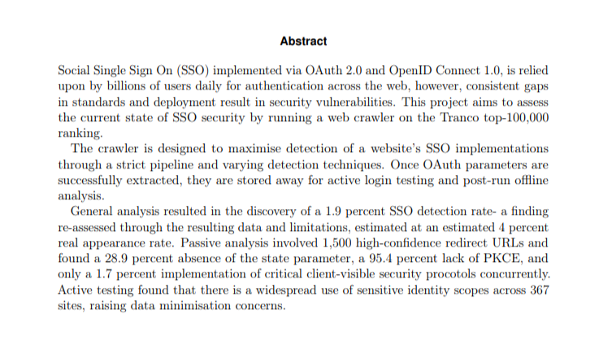
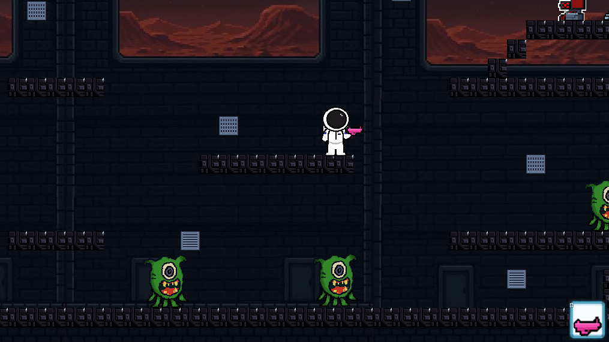
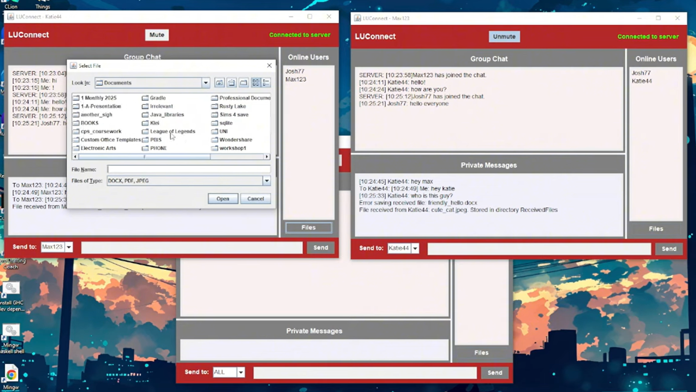

# Hi, I'm Martina 👋

**Computer Science student · Cybersecurity enthusiast · Game developer · Based in Prague**

I'm a Bachelor's student passionate about **web security** and application development. My thesis research focuses on OAuth 2.0 and OpenID Connect vulnerability analysis. I enjoy building things — from arcade games to security tooling.

---

## Projects

### OAuthScanner
> *Python · Security Research · Bachelor's Thesis*

A Python tool for automated analysis of **OAuth 2.0 and OpenID Connect vulnerabilities** across single or bulk website targets. Developed as part of my Bachelor's thesis.

`Python` `OAuth 2.0` `OpenID Connect` `Security Research`

📂 **[View repo](https://github.com/marticas-ful/OAuthScanner0)**

---

### Interstellar Adventure
> *Java · LibGDX · Group Project*

An 80s arcade-style space shooter built with LibGDX in Java. I led the team, designed all animation for the protagonist and enemies, built the weapons and upgrades system, coded protagonist and enemy UI, and handled map design.

`Java` `LibGDX` `Game Development` `Team Lead`

🎬 **[Watch demo](https://youtu.be/EFi5PzSpEQw)** &nbsp;|&nbsp; 📂 **[View repo](https://github.com/marticas-ful/Group-Project)** &nbsp;|&nbsp;

---

### LUConnect
> *Networking · Client–Server Architecture · Coursework*

A networked application supporting multiple users interacting with a server on a local machine. Demonstrates socket-based client–server communication.

🎬 **[Watch demo](https://www.youtube.com/watch?v=Mzj30ZyFgpg)** &nbsp;|&nbsp; 📂 **[View repo](https://github.com/marticas-ful/LUConnect)**

`Networking` `Sockets` `Client–Server`

---

## 🛠️ Skills

| Skill | Level |
|---|---|
| Python | Proficient |
| Java | Proficient |
| C | Intermediate |
| Machine Code | Familiar |
| Robotics | Familiar |
| Git | Proficient |

---

## 🎓 Education

🏛️ **Bachelor of Science in Computer Science**
Your University Name · Expected 2026

[→ Programme description](https://www.lancasterleipzig.de/study/undergraduate/courses/computer-science-bsc/)

*Focus areas: web security, networked systems, software engineering*

---

## 🤝 Connect with me

